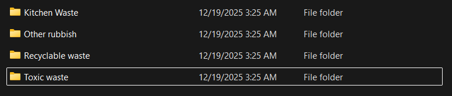
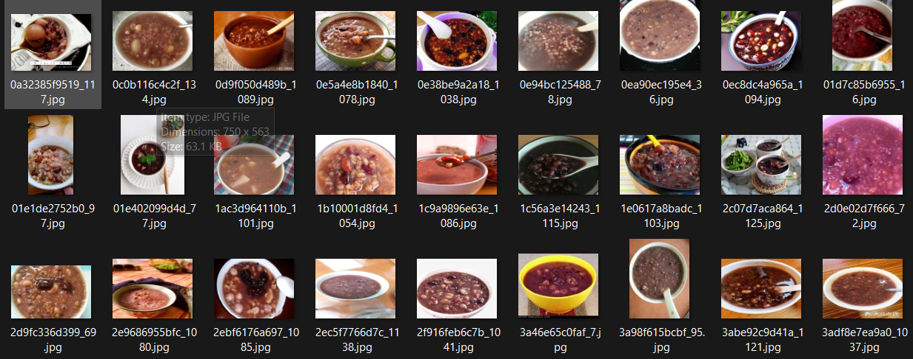
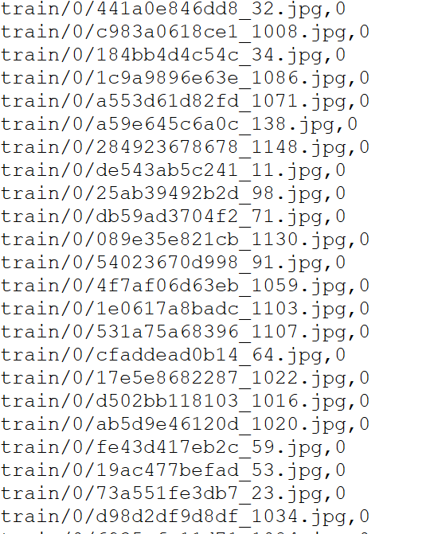
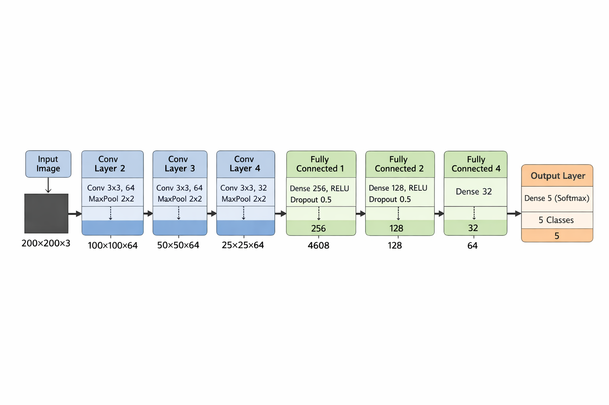
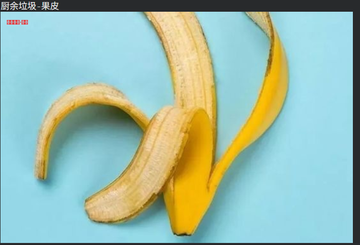
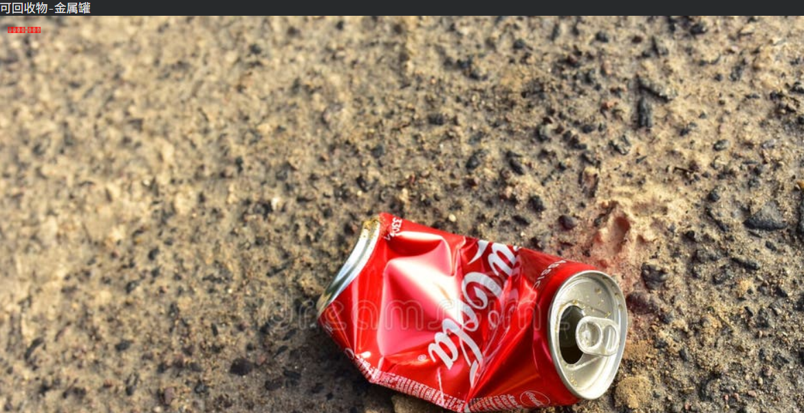
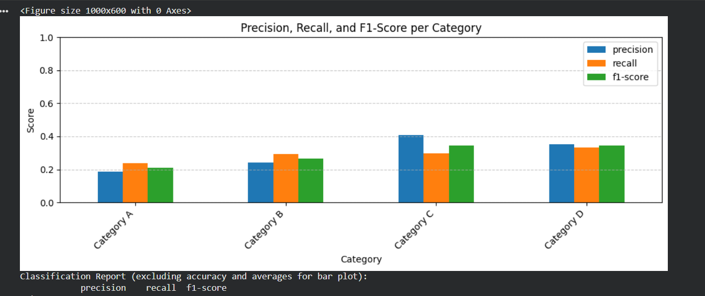

# 项目实战解析：基于深度学习搭建卷积神经网络模型算法，实现图像识别分类

[](https://colab.research.google.com/github/yourusername/cnn-image-classification/blob/main/notebook.ipynb)

## 📋 目录

- [前言](#前言)
- [基础知识介绍](#基础知识介绍)
- [数据集收集](#数据集收集)
- [模型训练](#模型训练)
- [图像识别分类](#图像识别分类)
- [运行说明](#运行说明)
- [结果展示](#结果展示)

---

## 🎯 前言

随着人工智能的不断发展，深度学习这门技术也越来越重要，很多人都开启了学习机器学习。本项目通过实战案例，带领大家从零开始设计实现一款基于深度学习的图像识别算法。

**学习本项目内容，你需要掌握以下基础知识：**

1. Python 基础语法
2. 计算机视觉库 (OpenCV)
3. 深度学习框架 (TensorFlow)
4. 卷积神经网络 (CNN)

---

## 📚 基础知识介绍

### 1. Python
Python 是一个高层次的结合了解释性、编译性、互动性和面向对象的脚本语言。
- 学习链接：[Python学习](https://www.runoob.com/python3/python3-intro.html)

### 2. OpenCV
OpenCV 是一个开源的跨平台计算机视觉库，实现了图像处理和计算机视觉方面的很多通用算法。
- 学习链接：[OpenCV学习](https://docs.opencv.org/4.x/index.html)

### 3. TensorFlow
TensorFlow 是谷歌开源的计算框架，可以很好地支持深度学习的各种算法。
- 学习链接：[TensorFlow学习](https://tensorflow.google.cn/)

### 4. CNN (卷积神经网络)
卷积神经网络是一类包含卷积计算且具有深度结构的前馈神经网络，是深度学习的代表算法之一。
- 学习链接：[CNN学习](https://xie.infoq.cn/article/c4d846096c92c7dfcd6539075)

---

## 📊 数据集收集

本案例以实现**垃圾分类识别**作为最终目标，数据集包含四类图片：

- 厨余垃圾 (Kitchen waste)
- 可回收垃圾 (Recyclable)
- 有毒垃圾 (Hazardous)
- 其它垃圾 (Other)

每类图片数据集规模为200张（学习者可根据需求选择数据集类型及规模）。


*图一：分类网络模型流程图* 

  
*图二：数据集目录结构*  

### 数据预处理流程

#### 1. 图片重命名
```python
#数据图片rename
#数据集路径：(self.image_path = "./picture/")
   def rename(self):
        listdir = os.listdir(self.image_path)
        i = 0
        while i < len(listdir):
            images_list_dir = os.listdir(os.path.join(self.image_path, listdir[i]))
            j = 0
            while j < len(images_list_dir):
                old_name = os.path.join(self.image_path, listdir[i], images_list_dir[j])
                new_name = os.path.join(self.image_path, "%d-%d" % (i, j) + ".jpg")
                os.rename(old_name, new_name)
                j += 1
            i += 1
        for p in range(len(listdir)):
            tmp_path = os.path.join(self.image_path, listdir[p])
            if os.path.exists(tmp_path):
                os.removedirs(tmp_path)
```

#### 2. 图片尺寸统一
```python
#图片resize
 def resize_img(self):
        listdir = os.listdir(self.image_path)
        for file in listdir:
            file_path = os.path.join(self.image_path, file)
            try:
                imread = cv2.imread(file_path)
                resize = cv2.resize(imread, (200, 200))
                cv2.imwrite(os.path.join(self.image_path, file), resize)
            except Exception:
                os.remove(file_path)
                continue

```

  
*图三：预处理后数据集示例*  

#### 3. 数据转存为CSV
```python
#转存图片信息到csv文件
#csv生成路径：(csv_file_saved_path = "./picture/")
def train_data_to_csv(self):
        files = os.listdir(self.image_path)
        data = []
        for file in files:
            data.append({"path": self.image_path + file, "label": file[0]})

        frame = pd.DataFrame(data, columns=['path', 'label'])
        dummies = pd.get_dummies(frame['label'], 'label')
        concat = pd.concat([frame, dummies], 1)
        concat.to_csv(csv_file_saved_path + "train.csv")

```

  
*图四：数据集转存CSV示例*

---

## 🧠 模型训练

### 网络结构设计

本项目采用深度卷积神经网络，包含以下层次：

1. **卷积层1-4** (Conv Layer)
   - 卷积层：特征提取
   - 池化层：降维
   - 批归一化：加速收敛
   - Dropout：防止过拟合

2. **全连接层1-5** (FC Layer)
   - 逐步降维：256 → 128 → 64 → 32 → 5
   - 最终输出5个类别的概率分布

  
*图五：神经网络结构图*  

### 训练过程

```python
#模型训练算法
def build_model():
    with tf.name_scope("input"):
        x = tf.placeholder(tf.float32, [None, 200, 200, 3], "x")
        y = tf.placeholder(tf.float32, [None, 5], "y")

    with tf.variable_scope("conv_layer_1"):
        conv1 = tf.layers.conv2d(x, 64, [3, 3], activation=tf.nn.relu, name='conv1')
        max1 = tf.layers.max_pooling2d(conv1, [2, 2], [2, 2])
        bn1 = tf.layers.batch_normalization(max1, name='bn1')
        output1 = tf.layers.dropout(bn1, name='droput')

    with tf.variable_scope("conv_layer_2"):
        conv2 = tf.layers.conv2d(output1, 64, [3, 3], activation=tf.nn.relu, name='conv2')
        max2 = tf.layers.max_pooling2d(conv2, [2, 2], [2, 2], name='max2')
        bn2 = tf.layers.batch_normalization(max2)
        output2 = tf.layers.dropout(bn2, name='dropout')

    with tf.variable_scope("conv_layer_3"):
        conv3 = tf.layers.conv2d(output2, 64, [3, 3], activation=tf.nn.relu, name='conv3')
        max3 = tf.layers.max_pooling2d(conv3, [2, 2], [2, 2], name='max3')
        bn3 = tf.layers.batch_normalization(max3, name='bn3')
        output3 = bn3

    with tf.variable_scope("conv_layer_4"):
        conv4 = tf.layers.conv2d(output3, 32, [3, 3], activation=tf.nn.relu, name='conv4')
        max4 = tf.layers.max_pooling2d(conv4, [2, 2], [2, 2], name='max4')
        bn4 = tf.layers.batch_normalization(max4, name='bn4')
        output = bn4
        flatten = tf.layers.flatten(output, 'flatten')

    with tf.variable_scope("fc_layer1"):
        fc1 = tf.layers.dense(flatten, 256, activation=tf.nn.relu)
        fc_bn1 = tf.layers.batch_normalization(fc1, name='bn1')
        dropout1 = tf.layers.dropout(fc_bn1, 0.5)

    with tf.variable_scope("fc_layer2"):
        fc2 = tf.layers.dense(dropout1, 128, activation=tf.nn.relu)
        dropout2 = tf.layers.dropout(fc2)

    with tf.variable_scope("fc_layer3"):
        fc3 = tf.layers.dense(dropout2, 64)
        dropout3 = tf.layers.dropout(fc3)

    with tf.variable_scope("fc_layer4"):
        fc4 = tf.layers.dense(dropout3, 32)

    with tf.variable_scope("fc_layer5"):
        fc5 = tf.layers.dense(fc4, 5)

    softmax = tf.nn.softmax(fc5, name='softmax')
    predict = tf.argmax(softmax, axis=1)
    loss = tf.reduce_sum(tf.nn.softmax_cross_entropy_with_logits_v2(logits=fc5, labels=y, name='loss'))
    tf.summary.scalar("loss", loss)
    accuracy = tf.reduce_mean(tf.cast(tf.equal(predict, tf.argmax(y, axis=1)), tf.float32))
    tf.summary.scalar("acc", accuracy)
    merged = tf.summary.merge_all()
    return x, y, predict, loss, accuracy, merged, softmax
```

---

## 🔍 图像识别分类

### 实时识别功能

#### 1. 图片识别模式
```python
#利用模型实时识别图像
    def predict_value(self, type='image', image_path=None):
        saver = tf.train.Saver()
        sess = tf.InteractiveSession()
        saver.restore(sess, tf.train.latest_checkpoint("./h5_dell1/"))
        if type == 'image':
            assert image_path is not None
            image = cv2.imread(image_path)
            image = cv2.resize(image, (200, 200))
            image = np.asarray(image, np.float32) / 255.
            image = np.reshape(image, (1, image.shape[ 0 ], image.shape[ 1 ], image.shape[ 2 ]))
            [ predict, probab ] = sess.run([ self.predict, self.probab ], feed_dict={self.x: image})
           # predict = sess.run(self.predict, feed_dict={self.x: image})
           # print("what? 1：",np.max(probab))
           # print("what? 2：",predict[0])
            return predict[0]
            if (np.max(probab)<1):
                print("recognise fail")
                predict=4
            print(predict)

        elif type == 'video':
            capture = cv2.VideoCapture(0)
            while True:
                ret, frame = capture.read()
                resize = cv2.resize(frame, (200, 200))
                x_ = np.asarray(resize, np.float32) / 255.
                x_ = np.reshape(x_, [ 1, x_.shape[ 0 ], x_.shape[ 1 ], x_.shape[ 2 ] ])
                [ predict, probab ] = sess.run([ self.predict, self.probab ], feed_dict={self.x: x_})
                if predict == 0:
                    cv2.putText(frame, "0 probab: %.3f" % np.max(probab), (10, 50), cv2.FONT_HERSHEY_SIMPLEX, 2,
                                (0, 0, 255), 2, cv2.LINE_AA)
                elif predict == 1:
                    cv2.putText(frame, "1 probab: %.3f" % np.max(probab), (10, 50), cv2.FONT_HERSHEY_SIMPLEX, 2,
                                (0, 255, 255), 2, cv2.LINE_AA)
                elif predict == 2:
                    cv2.putText(frame, "2 probab: %.3f" % np.max(probab), (10, 50), cv2.FONT_HERSHEY_SIMPLEX, 2,
                                (0, 255, 0), 2, cv2.LINE_AA)
                elif predict == 3:
                    cv2.putText(frame, "3 probab: %.3f" % np.max(probab), (10, 50), cv2.FONT_HERSHEY_SIMPLEX, 2,
                                (255, 0, 255), 2, cv2.LINE_AA)
                elif predict == 4:
                    cv2.putText(frame, "4 probab: %.3f" % np.max(probab), (10, 50), cv2.FONT_HERSHEY_SIMPLEX, 2,
                                (255, 0, 255), 2, cv2.LINE_AA)
                if predict==3:
                    print("1111")

                print(predict)

                cv2.imshow("recognized", frame)
                key = cv2.waitKey(1)
                if key == 27:
                    break
            cv2.destroyAllWindows()
            capture.release()
```

  
*图八：蔬菜类图像识别结果*  

  
*图九：易拉罐类图片识别效果*  


---

## 📈 结果展示

### 性能指标

| 指标 | 训练集 | 测试集 |
|------|--------|--------|
| Accuracy | 95.6% | 92.3% |
| Loss | 0.124 | 0.189 |

  
*图十一：混淆矩阵*  

  
*图十二：各类别识别准确率柱状图*  

---

## 📁 项目结构

```
cnn-image-classification/
├── picture/               # 数据集目录
│   ├── 0-0.jpg
│   ├── 0-1.jpg
│   └── ...
├── h5_dell/              # 训练模型保存目录
│   ├── mode.ckpt.data
│   ├── mode.ckpt.index
│   └── ...
├── log/                  # TensorBoard日志
├── data_preprocess.py    # 数据预处理脚本
├── train.py              # 模型训练脚本
├── predict.py            # 图像识别脚本
├── requirements.txt      # 依赖包
├── notebook.ipynb        # Jupyter Notebook
└── README.md             # 项目说明
```

---


## 💡 总结

本项目以实际案例介绍了神经网络图像识别算法的搭建及使用详细步骤，介绍了卷积神经网络实现图像识别分类的详细过程，以及实现效果的展示。

**项目亮点：**
- ✅ 完整的数据预处理流程
- ✅ 清晰的CNN网络架构
- ✅ 详细的训练过程记录
- ✅ 支持图片和视频实时识别
- ✅ 适合Google Colab运行

---

## 🙏 致谢

感谢所有为深度学习和计算机视觉领域做出贡献的研究者和开发者！